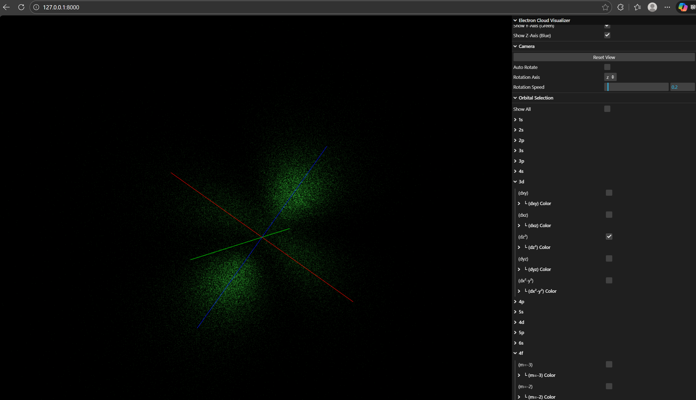

# Electron Cloud Visualizer

An interactive 3D visualization tool for exploring atomic electron orbitals and electron clouds using quantum mechanics principles.
Introduction Video:  https://youtu.be/lwqq6FTS6bQ



## Features

- **Interactive 3D Visualization**: Explore electron orbitals in real-time with mouse controls
- **All Elements**: Visualize electron configurations for all 118 elements
- **Individual Orbital Control**: Toggle visibility and customize colors for each orbital (s, p, d, f)
- **Quantum Mechanics Accurate**: Uses real wave functions and CDF sampling for accurate probability distributions
- **Progressive Loading**: Smooth rendering with progressive particle generation
- **Advanced Controls**:
  - Particle count adjustment (5,000 - 1,000,000 particles)
  - Particle size and opacity controls
  - Atom scaling
  - Animation with adjustable speed
  - Clipping planes for cross-sectional views
  - Coordinate axes display
  - Auto-rotation with axis selection
  - Individual orbital color customization

## Demo

Open `index.html` in a modern web browser to start exploring electron orbitals.

## Usage

1. **Select an Element**: Use the "Atomic Number" slider and click "Update Element"
2. **Choose Orbitals**: Expand orbital shells in the "Orbital Selection" panel to show/hide specific orbitals
3. **Customize Colors**: Click on color folders to customize individual orbital colors
4. **Adjust Display**: Modify particle count, size, opacity, and scale in "Display Options"
5. **Camera Controls**: 
   - Left mouse: Rotate view
   - Right mouse: Pan
   - Scroll: Zoom
   - Use "Auto Rotate" for automatic rotation

## Technical Details

### Quantum Mechanics Implementation

- Uses hydrogen-like wave functions with Z=1 for accurate orbital shapes
- Implements real spherical harmonics for proper orbital orientation
- CDF (Cumulative Distribution Function) sampling for probability-based particle distribution
- Radial probability function: r² × |R(n,l,r)|²

### Technology Stack

- **Three.js r128**: 3D rendering and visualization
- **lil-gui**: User interface controls
- **Vanilla JavaScript**: No build tools required
- **WebGL**: Hardware-accelerated graphics

### Project Structure

```
electron-cloud-visualizer/
├── index.html              # Main HTML file
├── styles.css              # Styling
├── js/
│   ├── constants.js        # Physical and mathematical constants
│   ├── math-utils.js       # Mathematical utilities and spherical harmonics
│   ├── quantum-mechanics.js # Wave function calculations
│   ├── particle-sampler.js # CDF-based particle generation
│   ├── electron-configuration.js # Electron configuration system
│   ├── visualization-renderer.js # Three.js rendering
│   ├── gui-controller.js   # User interface controls
│   ├── app-controller.js   # Application coordination
│   └── main.js             # Entry point
└── README.md
```

## Browser Compatibility

Requires a modern browser with WebGL support:
- Chrome 90+
- Firefox 88+
- Safari 14+
- Edge 90+

## Performance

- Default particle count: 100,000
- Maximum particle count: 1,000,000
- GPU acceleration via WebGL
- Progressive loading for smooth user experience
- Optimized for high atomic numbers

## Credits

Created by **Andy Kong**

## License

MIT License - See LICENSE file for details

## Acknowledgments

- Inspired by [Kavan Ghaderpour's Atom Visualizer](https://www.kavang.com/atom)
- Quantum mechanics principles from standard atomic physics textbooks
- Three.js community for excellent 3D rendering library


